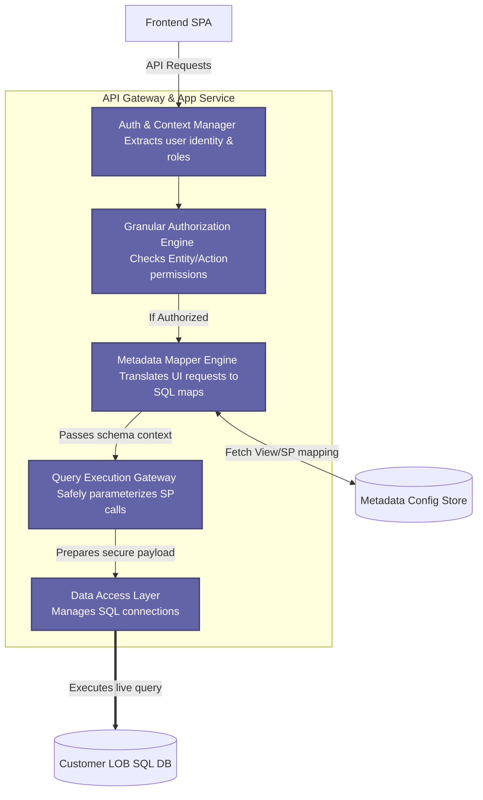
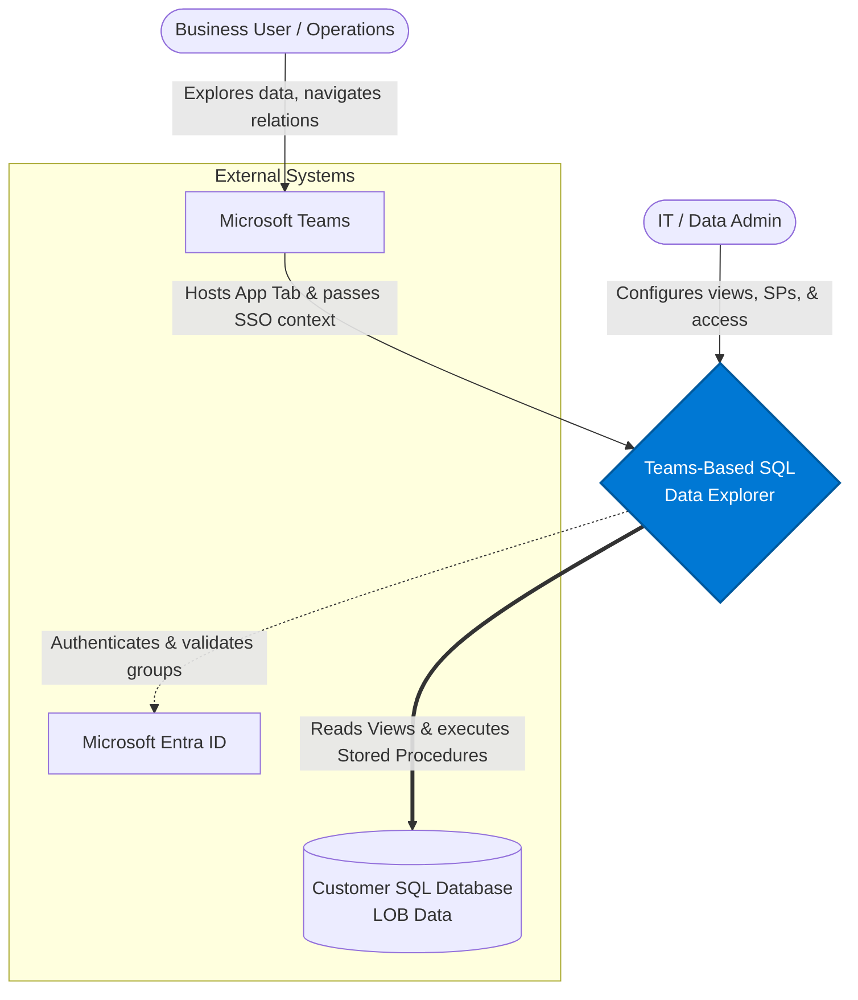
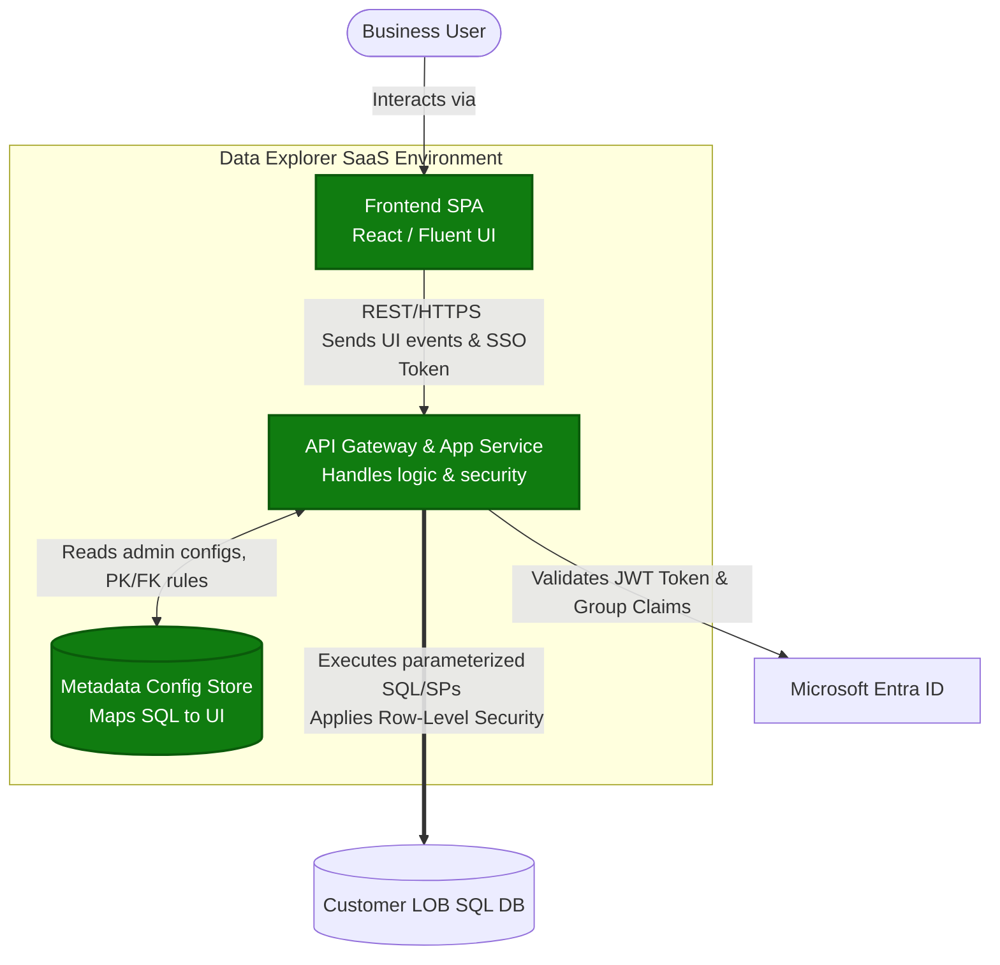

Here are the visual architecture diagrams for the **Teams-Based Data Explorer**, following the **C4 Model** (Context, Container, Component). Here are the visual architecture diagrams for the **Teams-Based SQL Data Explorer**, following the **C4 Model** (Context, Container, Component). 

---

### Level 1: System Context Diagram
**Purpose:** Shows the high-level system, the users interacting with it, and the external systems it integrates with. It focuses on the "big picture."

---

### Level 2: Container Diagram
**Purpose:** Zooms into the System to show the high-level executable containers (applications, APIs, databases) and how they communicate.

---

### Level 3: Component Diagram (API / Backend Layer)
**Purpose:** Zooms into the **API Gateway & App Service** container to show the internal modular components that make the dynamic generation possible.

---

### Notes on Level 4 (Code)
In the C4 model, Level 4 (Code) is typically omitted unless documenting a highly complex, non-standard algorithm. Because this solution relies on standard mapping patterns (translating JSON metadata into SQL parameters and UI components), the Component layer provides sufficient detail for architects and engineering leads to begin implementation.

These are generated using Mermaid.js, which renders directly in most modern Markdown viewers.

---

### Level 1: System Context Diagram
**Purpose:** Shows the high-level system, the users interacting with it, and the external systems it integrates with. It focuses on the "big picture."

---

### Level 2: Container Diagram
**Purpose:** Zooms into the System to show the high-level executable containers (applications, APIs, databases) and how they communicate.

---

### Level 3: Component Diagram (API / Backend Layer)
**Purpose:** Zooms into the **API Gateway & App Service** container to show the internal modular components that make the dynamic generation possible.

---

### Notes on Level 4 (Code)
In the C4 model, Level 4 (Code) is typically omitted unless documenting a highly complex, non-standard algorithm. Because this solution relies on standard mapping patterns (translating JSON metadata into SQL parameters and UI components), the Component layer provides sufficient detail for architects and engineering leads to begin implementation.
