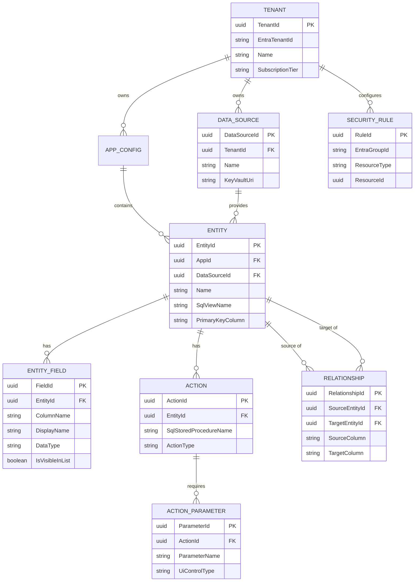

Here is the **Data Model & Schema Design** for the SmartData - Teams-Based Data Explorer. 

### Core Premise: The Metadata-Driven Architecture
It is critical to establish that **this schema does not store the customer’s Line-of-Business (LOB) data.** The LOB data remains securely in the customer's SQL database. 

Instead, this data model represents the **Metadata Configuration Store** (the SaaS backend database). It stores the definitions, UI mappings, security rules, and connection details required to dynamically generate the application in Microsoft Teams.

---

### 1. Entity Relationship Diagram (ERD)

---

### 2. Detailed Schema Definitions

#### A. Tenancy & Connectivity
Manages the SaaS multi-tenant isolation and secure connections to customer SQL databases.

*   **`Tenant`**
    *   `TenantId` (UUID, PK)
    *   `EntraTenantId` (String): Microsoft Entra Directory ID for SSO validation.
    *   `Name` (String): Customer organization name.
    *   `SubscriptionTier` (String): Free, Pro, Enterprise (controls feature limits).
*   **`DataSource`**
    *   `DataSourceId` (UUID, PK)
    *   `TenantId` (UUID, FK)
    *   `Name` (String): E.g., "ERP Production DB".
    *   `KeyVaultUri` (String): Secure reference to Azure Key Vault storing the actual encrypted connection string. (Never store raw credentials in this table).

#### B. Presentation & Mapping (The "Views")
Maps customer SQL Views to the dynamically generated UI lists and detail pages.

*   **`AppConfig`**
    *   `AppId` (UUID, PK)
    *   `TenantId` (UUID, FK)
    *   `AppName` (String): E.g., "Customer Service Portal".
    *   `TeamsAppId` (String): Maps the config to a specific Teams manifest.
*   **`Entity`**
    *   `EntityId` (UUID, PK)
    *   `AppId` (UUID, FK)
    *   `DataSourceId` (UUID, FK)
    *   `DisplayName` (String): E.g., "Customers".
    *   `SqlViewName` (String): The exact name of the SQL View (e.g., `vw_ActiveCustomers`).
    *   `PrimaryKeyColumn` (String): Required for drill-down and record identification.
*   **`EntityField`**
    *   `FieldId` (UUID, PK)
    *   `EntityId` (UUID, FK)
    *   `ColumnName` (String): Exact SQL column name.
    *   `DisplayName` (String): Human-readable UI label.
    *   `DataType` (String): String, Int, Date, Decimal, Boolean.
    *   `IsVisibleInList` (Boolean): Does this show up in the main grid, or only in the detail view?
    *   `DisplayOrder` (Int): Controls column rendering order from left to right.

#### C. Execution & Interaction (The "Stored Procedures")
Maps Stored Procedures to UI features like Search, Filtering, and Actions.

*   **`Action`**
    *   `ActionId` (UUID, PK)
    *   `EntityId` (UUID, FK)
    *   `DisplayName` (String): E.g., "Search by Date", "Approve Order".
    *   `SqlStoredProcedureName` (String): E.g., `sp_SearchOrders`.
    *   `ActionType` (Enum): `Search` (returns dataset), `Execute` (performs action/returns status).
*   **`ActionParameter`**
    *   `ParameterId` (UUID, PK)
    *   `ActionId` (UUID, FK)
    *   `ParameterName` (String): Exact SQL parameter (e.g., `@StartDate`).
    *   `DisplayName` (String): UI Label (e.g., "Start Date").
    *   `UiControlType` (Enum): `TextBox`, `DatePicker`, `ComboBox`, `Toggle`.
    *   `IsRequired` (Boolean): Enforces UI validation before executing the SP.

#### D. Relational Navigation (The "Drill-Down")
Allows users to click a record and navigate to related datasets instantly.

*   **`Relationship`**
    *   `RelationshipId` (UUID, PK)
    *   `SourceEntityId` (UUID, FK): E.g., Customer Entity.
    *   `TargetEntityId` (UUID, FK): E.g., Orders Entity.
    *   `SourceColumn` (String): Usually the PK (e.g., `CustomerID`).
    *   `TargetColumn` (String): Usually the FK (e.g., `CustomerID`).
    *   `RelationshipType` (Enum): `OneToMany`, `OneToOne`.

#### E. Security & Access Control
Maps Microsoft Entra ID groups to specific configuration elements.

*   **`SecurityRule`**
    *   `RuleId` (UUID, PK)
    *   `TenantId` (UUID, FK)
    *   `EntraGroupId` (String): The Object ID of the Entra Group (e.g., "Finance_Team").
    *   `ResourceType` (Enum): `App`, `Entity`, `Field`, `Action`.
    *   `ResourceId` (UUID): The specific ID of the resource being protected.
    *   `PermissionType` (Enum): `Read`, `Execute`, `Hidden`.

---

### 3. Key Architectural Considerations for this Schema

1.  **Performance via Caching:** Because this metadata dictates the UI, querying this database on every click would introduce latency. The API layer should cache `AppConfig`, `Entity`, and `Relationship` data in memory (e.g., Redis) per Tenant.
2.  **Row-Level Security (RLS) Passthrough:** Notice there is no row-level data security modeled here. The system relies on passing the `Entra User ID` directly into the LOB SQL database via `SESSION_CONTEXT()`. SQL Server handles the actual row filtering.
3.  **UI Generation Logic:** The frontend SPA reads `ActionParameter` records. If it sees `UiControlType = DatePicker`, it renders a calendar. When the user clicks "Submit," the SPA constructs a JSON payload matching the `ParameterName`s, which the API securely passes to `SqlStoredProcedureName`.
